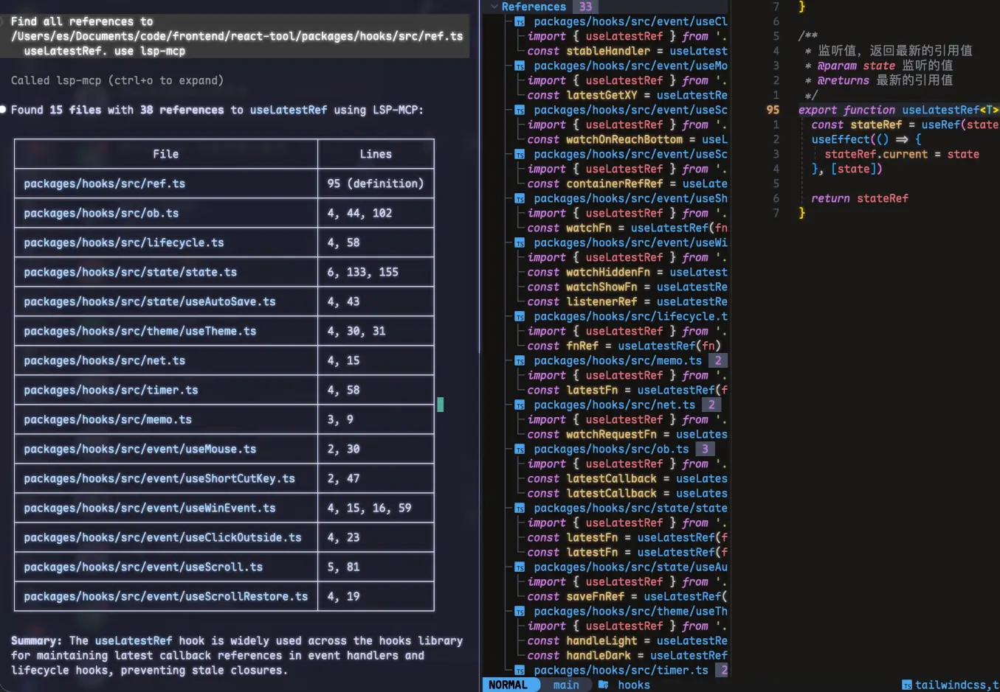

# VSCode LSP MCP

<p align="center">
  
</p>

<p align="center">
  <a href="https://marketplace.visualstudio.com/items?itemName=CJL.lsp-mcp">
    
  </a>
  <a href="https://marketplace.visualstudio.com/items?itemName=CJL.lsp-mcp">
    
  </a>
  <a href="https://marketplace.visualstudio.com/items?itemName=CJL.lsp-mcp">
    
  </a>
  <a href="https://github.com/beixiyo/vsc-lsp-mcp">
    
  </a>
  
  
</p>

<p align="center">
  <a href="./README.md">English</a> | <a href="./README.zh-CN.md">中文</a>
</p>

## 🔍 概述

VSCode LSP MCP 是一个 Visual Studio Code 扩展。**扩展 ID**：`cjl.lsp-mcp`

在 VS Code 中打开扩展视图（`Ctrl+Shift+X` / `Cmd+Shift+X`），搜索 **cjl.lsp-mcp** 可精确找到本插件

它通过模型上下文协议（MCP）暴露了语言服务器协议（LSP）功能。这使得 AI 助手和外部工具无需直接集成即可利用 VSCode 强大的语言智能功能




<a href="https://glama.ai/mcp/servers/@beixiyo/vsc-lsp-mcp">
  
</a>

### 🌟 为什么需要这个扩展？

像 Claude 和 Cursor 这样的大型语言模型难以准确理解你的代码库，因为：

- 它们依赖正则表达式模式查找符号，导致错误匹配
- 它们无法正确分析导入/导出关系
- 它们不理解类型层次结构或继承关系
- 它们的代码导航能力有限

此扩展弥合了这一差距，为 AI 工具提供了与 VSCode 内部使用的相同的代码智能！

## ⚙️ 功能

- 🔄 **LSP 桥接**：将 LSP 功能转换为 MCP 工具
- 🔌 **多实例支持**：自动处理多个 VSCode 窗口的端口冲突
- 🧠 **16 项 LSP 操作**：涵盖代码导航（定义、声明、实现、引用）、文档信息（悬停、补全）、结构分析（文档/工作区符号、调用层次）、代码重构（重命名）
- ☕ **Java 依赖源码**：通过 `jdt://` URI 获取 jdtls 反编译的类源码，便于 AI 阅读依赖库实现
- 📄 **双格式输出**：JSON 用于机器处理，Markdown 用于 LLM 友好阅读

## 🛠️ 暴露的 MCP 工具

| 操作 | 描述 |
|------|-------------|
| `hover` | 获取指定位置的悬停信息（文档、类型等） |
| `definition` | 获取符号的定义位置 |
| `declaration` | 获取符号的声明位置 |
| `implementation` | 获取符号的实现位置 |
| `references` | 查找符号的所有引用位置 |
| `completions` | 获取智能代码补全建议 |
| `document_symbols` | 获取文档的符号大纲树 |
| `workspace_symbols` | 按查询词在整个工作区搜索符号 |
| `class_file_contents` | 通过 jdt:// URI 获取反编译的 Java 类源码，用于阅读依赖库实现 |
| `rename` | 在工作区内重命名符号 |
| `symbol_at_position` | 获取指定位置的符号元数据（名称、类型、范围） |
| `incoming_calls` | 查找所有调用当前符号的位置 |
| `outgoing_calls` | 查找当前符号调用的所有被调用者 |

所有操作通过单个 `execute_lsp` MCP 工具调用，输入格式统一：
- `operation` — 要执行的 LSP 操作
- `uri` — 文件路径或 URI（支持普通路径和 `file://`/`jdt://` URI）
- `line` — 行号（**1-based**，与编辑器显示一致）。位置相关操作必填
- `character` — 列号（**1-based**，与编辑器显示一致）。位置相关操作必填
- `newName` — 仅 `rename` 操作需要
- `query` — 仅 `workspace_symbols` 操作需要

> **1-based 位置**：输入和输出都使用 1-based 行列值，与编辑器显示一致。VS Code 显示 `Ln 9, Col 16` → 传 `line: 9, character: 16`。输出中的位置值可直接用于下一次调用，无需任何转换。

## 📋 配置

<!-- configs -->

| 设置                              | 描述                                                                                       | 类型      | 默认值  |
| --------------------------------- | ------------------------------------------------------------------------------------------ | --------- | ------- |
| `lsp-mcp.enabled`                 | 启用或禁用 LSP MCP 服务器                                                                  | `boolean` | `true`  |
| `lsp-mcp.port`                    | LSP MCP 服务器的端口                                                                       | `number`  | `9527`  |
| `lsp-mcp.maxRetries`              | 端口被占用时的最大重试次数                                                                 | `number`  | `10`    |
| `lsp-mcp.cors.enabled`            | 启用或禁用 CORS（跨域资源共享）                                                            | `boolean` | `true`  |
| `lsp-mcp.cors.allowOrigins`       | 允许的 CORS 源。使用 `*` 允许所有源，或提供逗号分隔的源列表（例如 `http://localhost:3000,http://localhost:5173`） | `string`  | `*`     |
| `lsp-mcp.cors.withCredentials`    | 是否允许在 CORS 请求中携带凭证（cookie、授权标头）                                         | `boolean` | `false` |
| `lsp-mcp.cors.exposeHeaders`      | 允许浏览器访问的响应头。提供逗号分隔的头列表（例如 `Mcp-Session-Id`）        | `string`  | `Mcp-Session-Id` |
| `lsp-mcp.maxResults`           | 列表类结果的最大条目数（completions、workspace_symbols 等），防止 token 溢出 | `number` | `200` |
| `lsp-mcp.outputFormat`         | LSP 操作结果的输出格式。`json` 为机器可读 JSON，`markdown` 为 LLM 友好的 Markdown                  | `string`  | `json` |

<!-- configs -->

## 🔗 与 AI 工具集成

### Cursor

配置文件：`~/.cursor/mcp.json`（Windows 如 `%USERPROFILE%\.cursor\mcp.json`）

```json
{
  "mcpServers": {
    "lsp": {
      "url": "http://127.0.0.1:9527/mcp"
    }
  }
}
```

### OpenCode

配置文件：`~/.config/opencode/opencode.jsonc`

```json
{
  "mcp": {
    "lsp-mcp": {
      "type": "remote",
      "url": "http://127.0.0.1:9527/mcp",
      "enabled": true
    }
  }
}
```

### Claude Code

配置文件：`~/.claude.json`

```json
{
  "mcpServers": {
    "lsp-mcp": {
      "type": "http",
      "url": "http://127.0.0.1:9527/mcp"
    }
  }
}
```

### Gemini | IFlow

配置文件：`~/.gemini/settings.json`

```json
{
  "mcpServers": {
    "lsp-mcp": {
      "type": "streamable-http",
      "httpUrl": "http://127.0.0.1:9527/mcp"
    }
  }
}
```

### Codex

Config file: `~/.codex/config.toml`

```toml
[mcp_servers.lsp-mcp]
url = "http://127.0.0.1:9527/mcp"
```

### Roo Code

```json
{
  "mcpServers": {
    "lsp": {
      "type": "streamable-http",
      "url": "http://127.0.0.1:9527/mcp",
      "disabled": false
    }
  }
}
```

---

## 💻 开发

- 克隆仓库
- 运行 `pnpm install`
- 运行 `pnpm run update` 生成元数据
- 按 `F5` 开始调试
